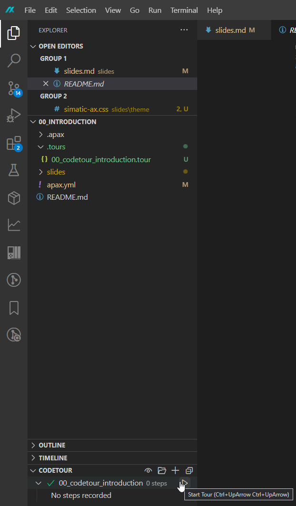
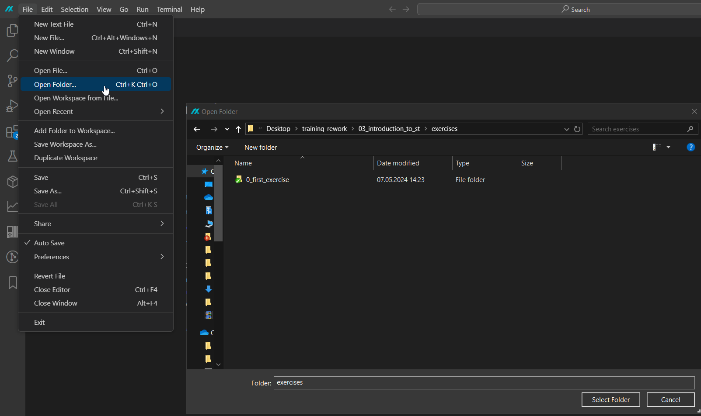

<!-- .slide: data-background="rgb(0,0,40)" -->
<!-- .slide: class="centered has-dark-background" -->
<h1>Introduction to SIMATIC AX</h1>
<h4>A complete introduction to the new engineering generation for SIMATIC controllers</h4>

---

<h1>Overview</h1>

  

    In this introductory course you will learn everything required to get started with the new engineering environment <strong>SIMATIC AX</strong>. Regardless if you are coming from TIA Portal or are starting new in the SIMATIC environment this learning path will guide you through the journey.
  

   
  

    To navigate between chapters (pages), please use the left/right arrows. To see more chapter content, use the up/down arrows when available. For a detailed overview of the controls, press F1 at any time of the presenation.
  

   
  

    To exit <strong>apax present</strong> in the terminal, please use "ctrl" + "c".
  

  

---

# Agenda

|  |  |
| -- | ----- |
| **00** | **Introduction to the workshop** |
| 01 | Introduction to AX Code IDE |
| 02 | Get started with your first AX Project |
| 03 | Loading and Debugging |
| 04 | Introduction to ST Programming |
| 05 | OOP Elements of ST |
| 06 | Unit Testing |
| 07 | Tools for commissioning |
| 08 | Package management |
| 09 | Versioning and Continuous Integration |

---

<header class="slide_header">
  <h2>Organization</h2>
  <h3>Path structure</h3>
</header>

  

    

    The learning path is split into submodules for each specific topic.
     
     
    Each submodule contains a description in form of a slide deck as well as an interactive CodeTour about a specific topic.
  
  
  

----

<header class="slide_header">
  <h2>Organization</h2>
  <h3>Folder structure</h3>
</header>

  

    

    Each learning module is contained in a subfolder of the repository
     
    It is made up of these components:
    

    <ul>
      <li><strong>slides:</strong> Slideshow for workshops</li>
      <li><strong>.tours:</strong> Interactive walkthrough using CodeTours extension</li>
      <li><strong>exercise:</strong> Additional self-learning material to test your skills</li>
    </ul>
  
  
  

----

<header class="slide_header">
  <h2>Organization</h2>
  <h3>Slides</h3>
</header>

  

    

    The slides can be interactively hosted locally on your PC. You need to install the tool <code>reveal-md</code> by typing this in your commandline:

     
    <pre>
      <code data-trim data-noescape>
        npm install reveal-md --global
      </code>
    </pre>
     
    <q><strong style="color: red">Note that this will install "third-party" software and is done at your own risk</strong></q>
     
    
You can then start the presentation by navigating to the module directory (e.g. 00_introduction) in the commandline and entering:

     
    <pre><code data-trim data-noescape>
      apax present
    </code></pre>
  
  
  

----

<header class="slide_header">
  <h2>Organization</h2>
  <h3>CodeTour</h3>
</header>
  

    
CodeTour is a Visual Studio Code extension, that can be used to create interactive tours in a VS Code project. To use the tours, please install the extension provided by Microsoft in the marketplace.

    
You will then find an additional drawer section in your explorer view:

  

  

  
  
  
  

----

<header class="slide_header">
  <h2>Organization</h2>
  <h3>Exercises</h3>
</header>
  

    
Some modules contain additional training materials, that allow you to apply the skills you've learned through hands-on exercises.

    
You can start the exercise by opening the folder in AX Code and following the README.md

  

  

  
  
  
  

---
<!-- .slide: data-background="rgb(0,0,40)" -->
<!-- .slide: class="centered has-dark-background" -->
<h3 style="margin-bottom: 1rem">Have fun learning</h3>
<h1 style="font-size: 6rem">SIMATIC AX</h1>

