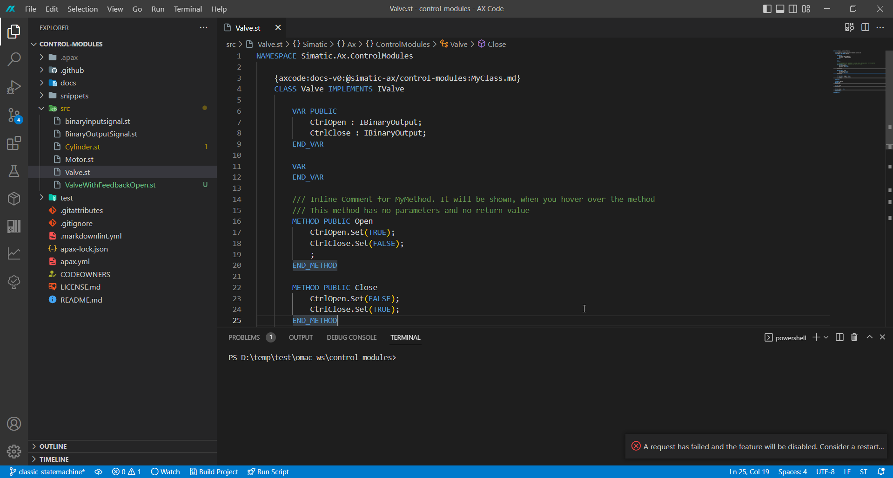
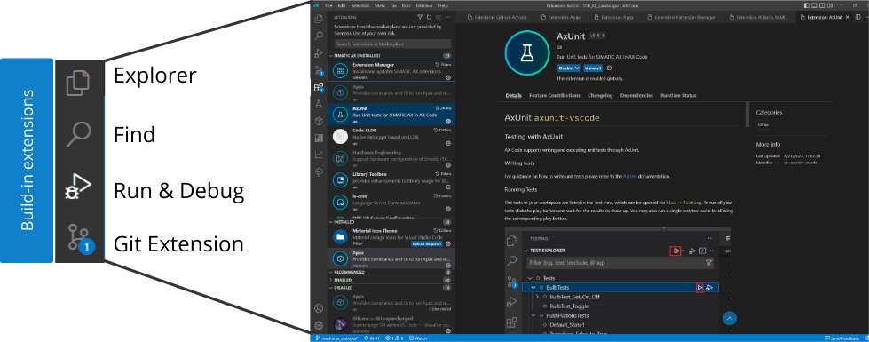
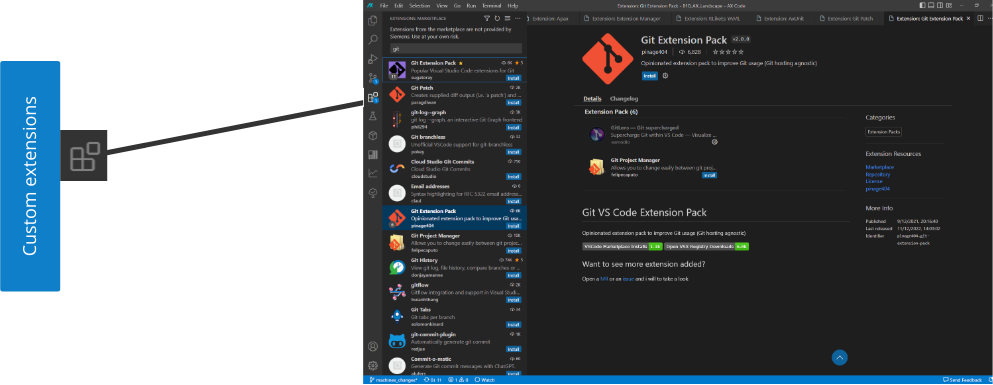
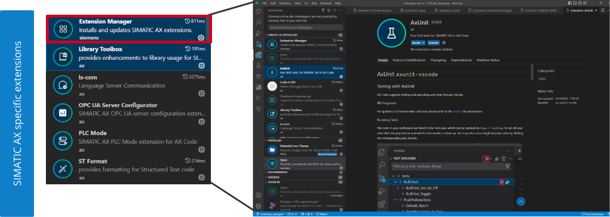
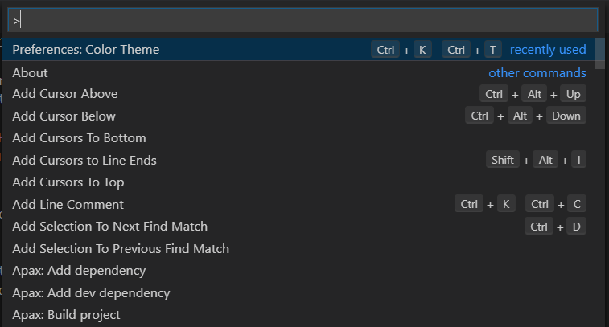
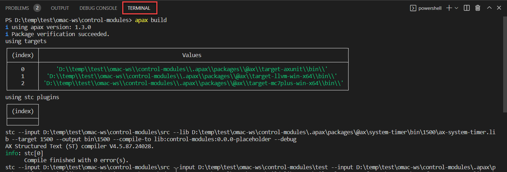
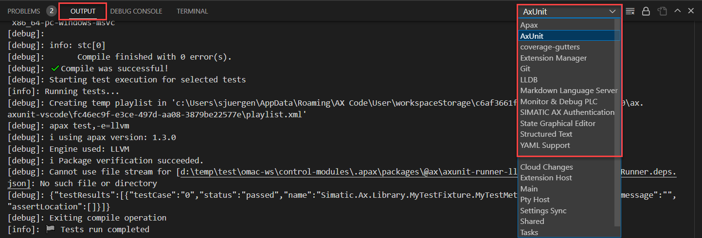
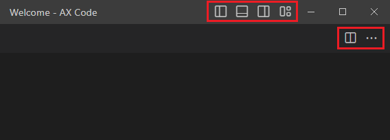
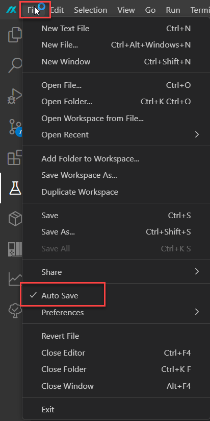

# Agenda

|  |  |
| -- | ----- |
| 00 | Introduction to the workshop |
| **01** | **Introduction to the SIMATIC AX Code IDE** |
| 02 | Get started with your first AX Project |
| 03 | Loading and Debugging |
| 04 | Introduction to ST Programming |
| 05 | OOP Elements of ST |
| 06 | Unit Testing |
| 07 | Tools for commissioning |
| 08 | Package management |
| 09 | Versioning and Continuous Integration |

---

<header class="slide_header">
  <h2>Prerequisites</h2>
</header>

  

    
To get started, you need to have SIMATIC AX, apax and all its prerequisites installed. To get access to the software you need a SiemensID account and a license for SIMATIC AX.

        <ul>
            <li><a href="https://console.simatic-ax.siemens.io/docs/get-started/prerequisites">Prerequisites for installing SIMATIC AX</a></li>
            <li><a href="https://console.simatic-ax.siemens.io/downloads">Download and install SIMATIC AX</a></li>
        </ul>
     
    
With this you are set up to continue with this learning path.

  

---

<header class="slide_header">
  <h2>
        What will you learn in this chapter
  </h2>
</header>

  

    
After you completed this training section you will 

        <ul>
            <li>have a rough overview about the SIMATIC AX Code IDE</li>
            <li>have learned about:</li>
            <ul>
                <li>using the terminal</li>
                <li>Built-In and AX Extensions</li>
                <li>window handling and editor customization</li>
            </ul>
        </ul>
     
  

---

<header class="slide_header">
  <h2>
        SIMATIC AX Code IDE
  </h2>
</header>

  

    
SIMATIC AX Code is an IDE based on Visual Studio Code, an immensly popular open source IDE created by Microsoft.

    
The IDE has been enriched with Siemens specific functionality to support the user while engineering a PLC.

  

    

---

<header class="slide_header">
  <h2>
        Built-In-Extensions
  </h2>
</header>

  

    
SIMATIC AX Code comes with a prefabricated set of extensions. Those extensions are available natively inside the IDE, e.g. GIT source control.

  

    

---

<header class="slide_header">
  <h2>
        Open VSIX Marketplace
  </h2>
</header>

  

    
Furthermore you have access to the Open VSIX marketplace and may add your favorite extensions like GitLens.

  

    

---

<header class="slide_header">
  <h2>
        Extension Manager
  </h2>
</header>

  

    
Besides third-party extensions, there are also SIMATIC AX specific extensions. Those extensions are installed via the extension manager, which is integrated into SIMATIC AX Code. The extension manager can also update the installed extensions automatically (optionally).

    
Some examples for SIMATIC AX specific extensions:

    <ul>
      <li>ST (according IEC61131-3) syntax highlighting</li>
      <li>AxUnit Test Explorer</li>
      <li>PLC Explorer</li>
      <li>Apax</li>
    </ul>
  

    

---

<header class="slide_header">
  <h2>
        Execute functionality in SIMATIC AX Code
  </h2>
</header>

  

    
While some of the functionalities of the extensions are accessible via the UI, you may access a more extended set of the functionalities via the command palette. To access them press <code>F1</code> or <code>Ctrl + Shift + P</code>

    
Here you can search for the functionality you require.

  

    

---

<header class="slide_header">
  <h2>
        Integrated terminal
  </h2>
</header>

  

    
The IDE provides a built-in terminal that lets you access the file system and execute CLI commands and scripts inside. You can open a new terminal via the top bar: "Terminal" > "New Terminal". 

  

    

---

<header class="slide_header">
  <h2>
        Output window
  </h2>
</header>

  

    
To support the user in debugging extension specific behavior and errors, an output panel is available. In the output panel you can take a look at outputs of various integrated extensions. 

    
Note that the output panel is always specific to the extension selected and can be switched using the drop down menu on the right.

  

    

---

<header class="slide_header">
  <h2>
        Window layout
  </h2>
</header>

  

    
You may change the current layout of the IDE to your liking. On the top right inside of SIMATIC AX Code you have the possibility to fully customize the layout of the windows.

    
You can also drag and drop the tab of the current editor and move it to the desired location

  

    

---

<header class="slide_header">
  <h2>
        Autosaving changes
  </h2>
</header>

  

    
When editing files inside the IDE, changes are not immediately mirrored back to your file system. Unsaved changes in a file won't be considered while executing any of the functionalities inside the IDE.

    
Hence, we recommend to always enable auto save

  

    

---

<header class="slide_header">
  <h2>
        What did you learn
  </h2>
</header>

  

    
You learned about...

    <ul>
      <li>different extensions in the IDE</li>
      <li>basic funtionalities of AX Code</li>
      <li>how to navigate and use the Editor</li>
    </ul>
  

