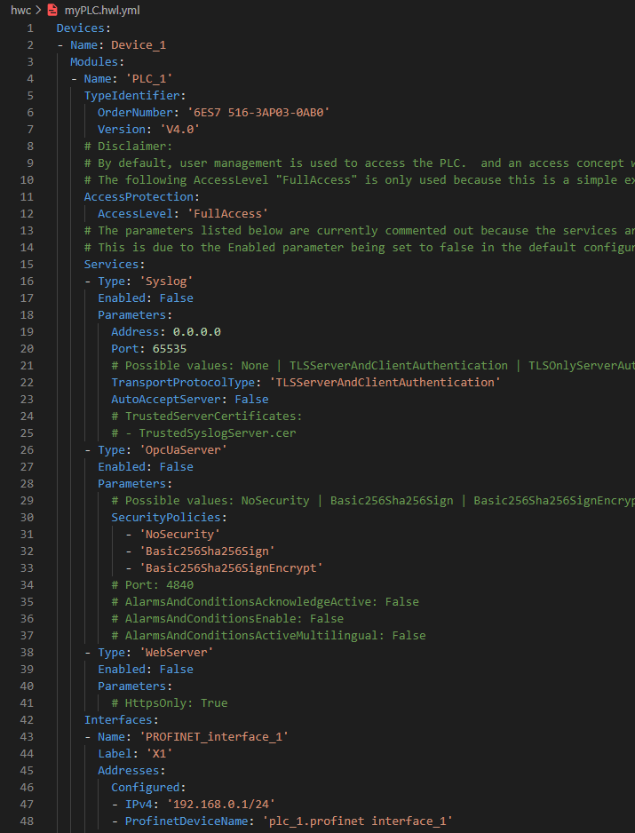
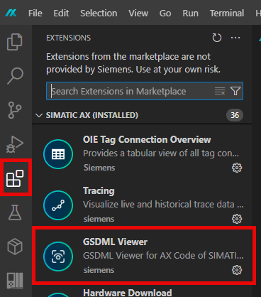
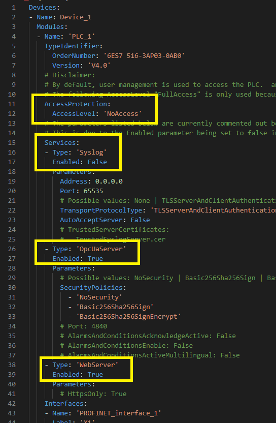
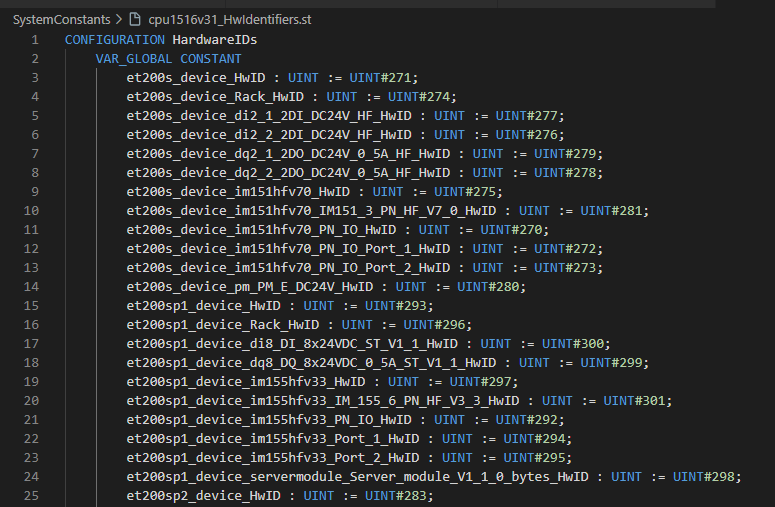

Agenda

| ID | Topic |
| -- | ----- |
| 00 | Introduction to the workshop |
| 01 | Introduction to AX Code IDE |
| 02 | Get started with your first AX Project |
| **03** | **Hardware Configuration** |
| 04 | Introduction to ST Programming |
| 05 | Loading and Debugging |
| 06 | OOP Elements of ST |
| 07 | Unit Testing |
| 08 | Tools for commissioning |
| 09 | Package management |

---

<header class="slide_header">
  <h2>Prerequisites</h2>
</header>

  

    
To get started, you need to have SIMATIC AX, apax and all its prerequisites installed.

    
In addition you should know the basics on how to use AX Code as well as have a starting project and know the basics of hardware configuration.

     
    
With this you are set up to continue with this learning path.

  

---

<header class="slide_header">
  <h2>
        What will you learn in this chapter
  </h2>
</header>

  

    
After you completed this training section you will 

        <ul>
            <li>Basic knowledge over hardware configuration</li>
            <li>Know how to insert hardware devices in project</li>
            <li>Using templates in hardware context</li>
            <li>Able to administrate Security Settings and Users</li>
            <li>Know how to assign the Hardware Device Identifiers</li>
            <li>Diagnostics in the hardware environment</li>
        </ul>
     

---

<header class="slide_header">
    <h2>IT Like Hardware Engineer</h2>
    <h3>The description of the configuration</h3>
</header>

    

        

        In order to be able to create hardware for a plc, the first step we need to take is how the hardware configuration is described in a textual declaration for a IT like context.

         
            
The format in which the hardware configuration is created is YML. YML has the following advantages as a format:
                <ul>
                    <li>text based</li>
                    <li>readable by humans</li>
                    <li>can be easily edited with a text editor</li>
                </ul>
            

         
        
The devices and dependent modules, including all properties, can be easily defined and set.

    

    

    <ol>
      <li>Information to YML format: <a href="https://en.wikipedia.org/wiki/YAML">YAML</a></li>
    </ol>

---

<header class="slide_header">
    <h2>IT Like Hardware Engineer</h2>
    <h3>Main Hardwars Tools</h3>
</header>

   
In the hardware environment, there are two basic tools that perform the main tasks. The tools are added with the apax add command, but are both included in the SDK. These are as follows:

    
   <ul>
      <li>HWC - Hardware Compiler
       The hardware compiler is the main engineering tool. Its main function is to support the customer in creating the hardware configuration (e.g., importing certificates, managing users, importing GSDMLS, and creating templates), as well as translating the configuration into the machine configuration that is also understood by the target. Furthermore, the plausibility of the configuration is checked during the translation process.
       The call of hwc via the CLI looks like this: <b>"apax hwc [command] [options]"</b>
      </li>
      <li>HWLD - Hardware Loader
       The main function of the hardware loader is to transfer the machine configuration, which was created via the hardware compiler, to the hardware.
       The call of hwc via the CLI looks like this: <b>"apax hwld [command] [parameters]"</b></li>
   </ul>
    
   
For more information about the components and the command and parameters, see:

   <ul>
      <li><a href="https://console.simatic-ax.siemens.io/docs/hw/hwc">Hardware Compiler</a></li>
      <li><a href="https://console.simatic-ax.siemens.io/docs/hw/hwld">Hardware Loader</a></li>
   </ul>

---

<header class="slide_header">
    <h2>IT Like Hardware Engineer</h2>
    <h3>Integration of additional hardware in project</h3>
</header>

  

    
To operate a system, you obviously need not only the PLC but also the corresponding modules, motors, and so on. Accordingly, AX also offers various options for incorporating configuration information for modules into the project. There are two options here:

        <ul>
            <li>The way of importing the hardware as standardized GSDML format.</li>
            <li>The standard Siemens modules that are supported are provided as apax packages and can be included as dev dependencies.</li>
        </ul>
     
    
In the following section we will show you how to proceed in order to have the hardware information available in the project.

     
    
We will show how the modules are integrated into the project in the following chapter on templates.

  

----

<header class="slide_header">
    <h3>Using of GSD Files</h3>
</header>

  
The GSD (General Station Description) format is a description language used to describe and parameterize hardware settings. It is a standard supported by all PROFINET device manufacturers. Accordingly, each hardware manufacturer provides the description file.
   
  
First, you need to contact the manufacturer of the module you want to use and obtain the GSD file. This is then usually inserted into the project. 
    We recommend creating a folder called gsd in the project and inserting the files there centrally. After that, you need to make the module known in the project so that you can use it. This is done with the help of the hardware compiler. You call:

   
  
<b>apax hwc install-gsd --input <name_of_GsdFile></b>

   
  
The install-gsd command will generate intermediate files that are required for Hardware Compiler from the GSDML or GSDX files.

   
  
These intermediate files will be placed in the GSD installation cache folder. If you use Hardware Compiler version 3.1 or later, it is located in the .ax folder of your user folder. After this the hardware compiler is ready to use the informations fron the gsdml file by the compile.

   
  <ol>
    <li>Additional Informations about GSDML: <a href="https://www.profibus.de/downloads/gsdml-gsdx-specification-for-profinet">GSDML Specification for PROFINET</a></li>
    <li>Additional Informations about the import of GSDML Files: <a href="https://console.simatic-ax.siemens.io/docs/hw/language/gsd-devices-and-modules">GSDML informations on AX Doku</a></li>
  </ol>

----

<header class="slide_header">
    <h3>Extension GSDML Viewer</h3>
</header>

    

       
Depending on how many assemblies it describes, a GSD file can become very large, making it difficult to determine which attributes an assembly has and which values ??it can assume.

        
       
For a graphical overview, we offer an extension that can be integrated into AX code (see image to the right). You can then click on a gsdml xml file, and it will open in the extension (see below).

        
    

    
  

  
   
<ol>
  <li>Additional Informations about GSDML Viewer: <a href="https://console.simatic-ax.siemens.io/docs/axcode/vscode-gsdml-viewer">GSDML Viewer on AX-Side</a></li>
</ol>

----

<header class="slide_header">
    <h3>Siemens Hardware over Support Packages</h3>
</header>

    
A hardware support package is viewed as a package from the AX side. Accordingly, it can be added to the project like any other package. You call the apax add command, as in the following example for importing the standard 1500 modules:

     
    
<b>apax add --dev @ax/hw-s7-1500</b>

     
    
The package can then be seen in Apax.yml under development dependencies:

    
     
    

        If you now open the project on another PC, the hardware information will also be added to the project via a simple Apax install.
        If additional Siemens hardware is required that is not yet offered as a hardware support package, it can of course also be imported as GSDML. 
    

     
    <ol>
      <li>A current overview of available hardware can be found in the AX documentation: <a href="https://console.simatic-ax.siemens.io/docs/hw/supported-hardware">Hardware Support Packages</a></li>
    </ol>

----

<header class="slide_header">
    <h3>Overview what Hardware is installed in project</h3>
</header>

    
You want to know which modules are known to the hardware compiler in the project, or/and what IDs they have. This can be done using a corresponding container in the hardware compiler, which looks like this:

     
    
<b>apax hwc get-supported-devices</b>

     
    
After this, you'll see an overview in the terminal that looks like this. This is divided into different types (modules/PLCs, etc.) and the type of integration (support packages or via GSD file).

     
    

---

<header class="slide_header">
    <h2>IT Like Hardware Engineer</h2>
    <h3>Using of Templates</h3>
</header>

  
The previous section showed how to use the configuration information in the project. There are basically two ways to do this:
  <ul>
     <li>You can create the valid hardware configuration file yourself in your way.</li>
     <li>You can have it created for you over the hardware compiler, which we deal with in this section</li>
  </ul>
   
  
The hardware compiler has the function of creating a template, which creates all the attributes made available for parameterization by the configuration file with the default values.

   
  
A template is initially referred to as the template of a hardware module, but later also as files that can be used multiple times in a project for modules with the same configuration. In this sense, hardware templates offer several advantages. Among other things, they can be:

  <ul>
     <li>Can stored centrally and used in the project.</li>
     <li>Can paramized by using placeholders</li>
     <li>Splitting the hardware configuration into several hwl files.</li>
  </ul>
   
  
It is important to note, however, that the identifier for the hardware compiler is the name. This means that a module name or template name in project must be unique and cannot be used multiple times.

----

<header class="slide_header">
    <h3>Templates form GSD</h3>
</header>

   

     
The prerequisite for creating a template from a GSD file is that it is installed in the project. To call it, you need the GSD ID of the assembly in the file.

      
     
The command used to create a template from a GDSML file is shown on the right. The file and assembly ID must be specified accordingly. The result of the execution is shown.

      
     
However, placeholders are assigned for the template and assembly names, which must be manually modified to prevent duplicate names from being assigned when creating a second template.

      
     <ol>
       <li>The GSDML for Siemens modules, one of which was also used for the ET200SP, can be downloaded from Siemens Support:  <a href="https://sieportal.siemens.com/en-ww/support">Link to Siemens Online Support Portal</a></li>
     </ol>
   

   

     
<b>apax hwc generate-template-file  --output hwc/templates/ET200SP_DQ_template.hwl.yml  --gsd-file-name GSDML-V2.43-Siemens-ET200SP-20240726.xml  --gsd-id "DQ 16x24VDC/0,5A ST" </b>

     
   

----

<header class="slide_header">
    <h3>Templates form hardware support packages</h3>
</header>

   
   

     
The templates from the modules that come via the Hardware Support Packages are created in the same way as with GSDML. This is the same command, only different parameters must be specified. The command looks like this:

      
     
<b>apax hwc generate-template-file  --output hwc/templates/MP_DQ_template.hwl.json  --order-number "6ES7 522-1BL00-0AB0"  --version V2.0 </b>

      
     
The "ordernumber" and "version" must be hand over. The generated faceplate can now be seen on the right.

   

----

<header class="slide_header">
    <h3>Using of placeholder</h3>
</header>

  
In the example shown here, the same template is used in an ET200SP. Accordingly, a different name is passed. Additionally, the white potential module is passed for the first module, which is not necessary for the second, since the black module is the default value. Here is an example of how it is used:

   
  

    

    
The variables are parameterized accordingly under the keyword <b>Placeholders</b>. The following things are defined using the following keywords:

    <ul>
     <li><b>Name:</b> The name of the placeholder, which is then also applied in the content</li>
     <li><b>Value:</b> The default value if the variable is not specified. If this is not set, the variable must always be specified when applying.</li>
     <li><b>AllowedValues:</b> 
A masking of the values ​​that can be entered. If, for example, the assembly has more setting options, but the process only allows certain values, this can be restricted.</li>
    </ul>
    
The keyword <b>Content</b> contains the description of the module with the application of the placeholder, see <b>"${Modulename}"</b>

    

    
  

----

<header class="slide_header">
    <h3>Apply templates</h3>
</header>

  
Now that the template is ready for use, it must be applied accordingly in main (the file that instantiates the plc) yml file.

   
  
To use a template, the keyword <b>"Apply"</b> is used. Additionally, the name of the template to be applied must be specified.
  Depending on whether placeholders are assigned and these are not initialized, they must be parameterized as <b>"Arguments"</b>.
 
  

    
    
In the example shown here, the same template is used in an ET200SP.  Accordingly, a different name is passed over the parameter <b>ModuleName</b>.  As an example for the use of the default values ​​in the template, the white potential module is passed over the parameter <b>"BaseUnit"</b> for the first module, which is not necessary for the second, since the black module is the default value.

  

<ol>
  <li> Additional information about templates can be found on the AX page: <a href="https://console.simatic-ax.siemens.io/docs/hw/language/templates">Templating in hardware configuration</a></li>
</ol>

---

<header class="slide_header">
    <h2>IT Like Hardware Engineer</h2>
    <h3>Security Settings</h3>
</header>
  

     
Like all Siemens software, Simatic AX also represents the principle of "Security by default". 
        Accordingly, the security aspects must be set up in the project before loading the PLC. 

       
Security consists the following two aspects:

       <ul>
         <li><b>Authentication</b> ensures that you are communicating with the expected PLC</li>
         <li><b>Authorization</b> ensures operations are only performed by users permitted to do so.</li>
       </ul>
  
  

<ol>
  <li>Informations about: <a href="https://console.simatic-ax.siemens.io/docs/hw/security">Security</a></li>
</ol>

----

<header class="slide_header">
    <h3>Set Up PLC Security Configuration</h3>
</header>

    

        

        To create the appropriate security settings for a PLC, you first need a PLC description file. The PLC is the central element in a hardware configuration, to which all other modules are interconnected. The basic configuration can now be created, for example, by generating a template from a PLC in a hardware support package.

         
            
In this file you can also set some basic settings in relation of Authentication and Authorization:
                <ul>
                    <li>Authentication: The services can be switched on here, such as OPCUA / Webserver</li>
                    <li>Authorization: The basic protection level is set here.</li>
                </ul>
            

         
    

    

    <ol>
      <li>Informations about: <a href="https://console.simatic-ax.siemens.io/docs/hw/security/authorization/plc-configuration-data-protection">PLC Configuration Data Protection</a></li>
    </ol>

----

<header class="slide_header">
    <h3>The PLC SecurityConfiguration File</h3>
</header>

----

<header class="slide_header">
    <h3>Certificat handling</h3>
</header>

OPCUA / TLS / Webserver

----

<header class="slide_header">
    <h2>IT Like Hardware Engineer</h2>
    <h3>User Managment UMAC</h3>
</header>

----

<header class="slide_header">
    <h3>Define Users and Roles in hwl.yml</h3>
</header>

----

<header class="slide_header">
    <h3>Set Password and manage user over command line of hwc</h3>
</header>

---

<header class="slide_header">
    <h2>IT Like Hardware Engineer</h2>
    <h3>Hardware Device Identifiers assignment</h3>
</header>

  
When you set up or assemble a system for the first time, it's important to assign basic identifiers, such as names or IP addresses, to the modules, since the modules are delivered with the same values ​​from the factory. This applies to the spare parts use case.  
  Therefore, AX must have a way for a module to know its unique identifiers. Accordingly, you can describe in AX which port is connected to which module. This allows the system to recognize which device is involved and assign the device identifiers based on the network interconnection.  
  The following is a parameterization example showing how different modules are connected to a scalancex208:

   
  

    
 The keyword <b>"PortInterconnections"</b> opens the section where you describe everything.   Using the word <b>"Ports"</b> and the corresponding reference (<b>"Ref"</b>), you specify which port is connected to which port via network cable.

    
  

<ol>
  <li> Additional information about templates can be found on the AX page: <a href="https://console.simatic-ax.siemens.io/docs/hw/language#creating-a-port-interconnection-between-two-ports-topology-configuration">Topology Configuration</a></li>
</ol>

---

<header class="slide_header">
    <h2>IT Like Hardware Engineer</h2>
    <h3>Constante Values that will be used in software programm</h3>
</header>

  
During hardware configuration, values/variables are created which must then be processed or accessed in the user program.

   
  
After compiling a hardware configuration, hwc will generate ST files including Hardware Identifiers and IO Addresses for each module inside the folder SystemConstants. The files or values ​​you need can simply be copied into the src folder of the software program.
   Additional information: When the PLC is generated, the values ​​assigned are also saved in JSON files in order to retain values ​​that have already been assigned.

   
  
We will briefly show the two files containing the values ​​on the following page.

----

<header class="slide_header">
    <h3>I/O Addresses</h3>
</header>

  
The I/O addresses are the addresses used to access the signals via the module. This is the process image that contains the current values ​​pending on the hardware or those to be written to the hardware.
   The I/O addresses of a module will be stored as largest possible type inside IoAddresses file.

   
  
Here is an example of what such a generated file looks like:

   
  

----

<header class="slide_header">
    <h3>Hardware Identifiers</h3>
</header>

    

      

Some functions require that you access the hardware in the program or specify which module it is. For this purpose, the hardware identifiers were created during compilation. These are of type UINT. The names correspond to the module name. An example of such a file looks like the one shown on the right.

      
    

---

<header class="slide_header">
    <h2>IT Like Hardware Engineer</h2>
    <h3>Diagnostic and hardware functions</h3>
</header>

  
When commissioning a program, you need various tools for general diagnostics, for example, to view or trace online values ​​from the PLC. Therefore, we have created a separate chapter in the Learning Path dedicated exclusively to general diagnostics. 
    However, we will show the hardware-specific diagnostic tools on next side, that you need to get your first hardware run.

----

<header class="slide_header">
    <h3>HW Overview and Online / Offline compare</h3>
</header>

  
One of the main hardware-specific diagnostics is checking the online status or checking whether the hardware parameterized in the project is compatible with the current status of the existing hardware.

   
  
The Ax Eco System provides the hardware diagnostics tool, which can be installed with <b>"apax add --dev @ax/hardware-diagnostics"</b> in the project like a package.

   
  
Once the tool is installed, you can run the corresponding command <b>apax hw-diag compare</b> to compare your online and offline hardware. It must be noted that appropriately parameterized authentication information such as user/password and certificate must also be transferred. The result will be displayed in the terminal and will look like the image below:

   
  

    
    <ul>
      <li><b>"Actual"</b> refers to the values ​​of the existing hardware</li>
      <li><b>"Configured"</b> refers to how configuration is done in the offline project</li>
    </ul>
  

<ol>
  <li> Additional information about hardware diagnostic can be found on the AX page: <a href="https://console.simatic-ax.siemens.io/docs/hardware-diagnostics">Hardware Diagnostic</a></li>
</ol>

---

<header class="slide_header">
    <h2>IT Like Hardware Engineer</h2>
    <h3>Exercise</h3>
</header>

    
Now it's time to put what you've learned into practice. To do this, please complete an exercise and follow the steps below. Feel free to flip back to the relevant pages for help.

    <ul>
      <li>Create a new project</li>
      <li>Add the components hwc, hwld</li>
      <li>Insert assemblies via packages and gsd</li>
      <li>Create the template of a PLC from the hardware support packages and perform the setup of the security functions</li>
      <li>Create a template for a profinet module from a GSDML. Set Placeholders in the template e.g. for the name. Apply and parameterize the template.</li>
      <li>Create also the topology connection for the profinet module.</li>
      <li>Create your own scripts in the apax yml for loading / user management and hardware diagnostics.</li>
      <li>Load your hardware configuratin and compare online with offline.</li>
    </ul>
     
     
    <ol>
        
The links to the following tool on the AX page are also helpful:

        <ul>
            <a href="https://console.simatic-ax.siemens.io/docs/plc-info">PLC Info to Start / Stop PLC over CLI</a>
        </ul>
    </ol>

---

<header class="slide_header">
    <h2>IT Like Hardware Engineer</h2>
    <h3>What did you learn?</h3>
</header>

   <ul>
     <li>How to create a hardware configuration</li>
     <li>How to set the security settings</li>
     <li>How to get assemblies into the project</li>
     <li>You have learned where to find a variable for the software program</li>
     <li>You have loaded your first hardware configuration</li>
   </ul>
    
   
Congratulations, you've created your first hardware configuration. We recommend, however, that you use a template to store your basic settings so you don't have to start from scratch every time and have your usual settings and scripts available right from the start.

