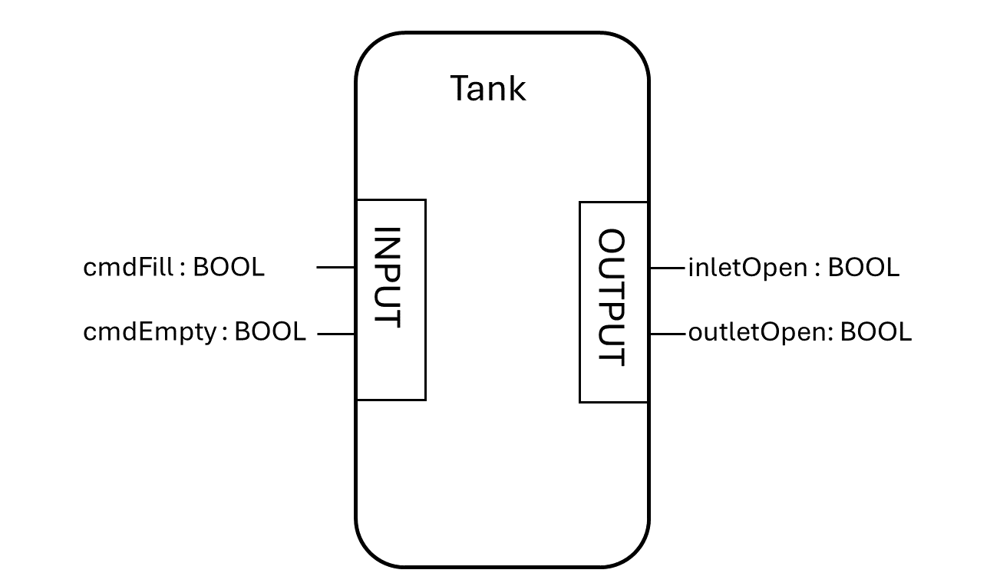
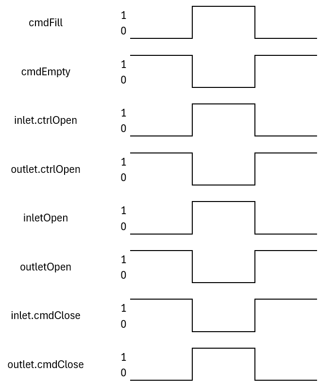

## Exercise 2: Implement a tank

### Function Block 'Tank'

* Write a function block 'Tank' which has an inlet valve and an outlet valve
* The tank block should be placed within a namespace 'EquipmentModules'
* Logic in Tank:
    * Create two instances of the valve (inlet and outlet)
    * Call them and set the variables according to the behavior (VAR)
* Create a instance of the tank in the VAR_GLOBAL section
* Call it in a PROGRAM
* Download the program to a PLC
* Modify the variables cmdFill and cmdEmpty of the Tank instance
* Monitor the inletOpen/outletOpen status of the tank

Interface of the tank:

Behavior of the tank:

