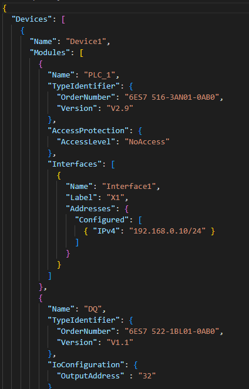
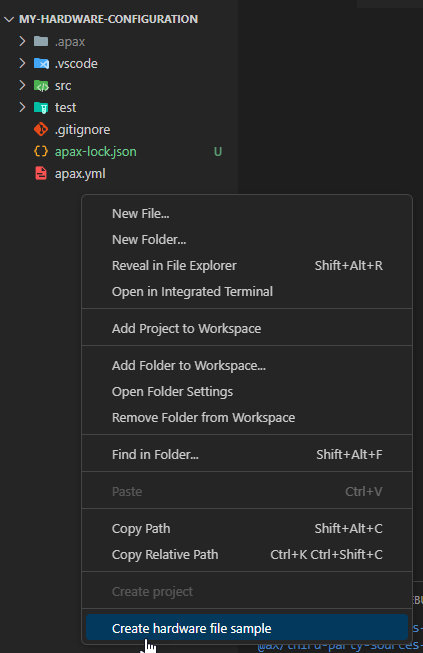

Agenda

| ID | Topic |
| -- | ----- |
| 00 | Introduction to the workshop |
| 01 | Introduction to AX Code IDE |
| 02 | Get started with your first AX Project |
| 03 | Introduction to ST Programming |
| 04 | Loading and Debugging |
| 05 | OOP Elements of ST |
| 06 | Unit Testing |
| 07 | Tools for commissioning |
| 08 | Package management |
| **09** | **Hardware Configuration** |

---

<header class="slide_header">
  <h2>Prerequisites</h2>
</header>

  

    
To get started, you need to have SIMATIC AX, apax and all its prerequisites installed.

    
In addition you should know the basics on how to use AX Code as well as have a starting project and know the basics of hardware configuration.

     
    
With this you are set up to continue with this learning path.

  

---

<header class="slide_header">
  <h2>
        What will you learn in this chapter
  </h2>
</header>

  

    
After you completed this training section you will 

        <ul>
            <li>know how to create and hardware configuration</li>
            <li>using templates in hardware context</li>
            <li>know how to do GSDML handling</li>
            <li>able to administrate Users over User Managment</li>
        </ul>
     
  

---

<header class="slide_header">
    <h2>IT Like Hardware Engineer</h2>
    <h3>The description of the configuration</h3>
</header>

    

        

        In order to be able to create hardware for a plc, the first step we need to take is how the hardware configuration is described in a textual declaration for a IT like context.

         
            
The format in which the hardware configuration is created is Json. Json has the following advantages as a format:
                <ul>
                    <li>text based</li>
                    <li>readable by humans</li>
                    <li>can be easily edited with a text editor</li>
                </ul>
            

         
        
The devices and dependent modules, including all properties, can be easily defined and set.

    

    

    <ol>
      <li>Definition of JSON:  <a href="https://ecma-international.org/publications-and-standards/standards/ecma-404/">ECMA-404</a></li>
    </ol>

---

<header class="slide_header">
    <h2>IT Like Hardware Engineer</h2>
    <h3>Create a hardware configuration</h3>
</header>

    

        

       To create your own hardware configuration, you just have to create a file with the ending ".hwl.sjon" or you can simply use the template that is provided via the hardware laguage server.
       

         
            
There are a few points here that need to be taken into account:
                <ul>
                    <li>The entry point is always the device</li>
                    <li>The name of the device will be used later for identification. If it is changed, some things have to be initialized again.</li>
                    <li>A piece of hardware can consist of several files</li>
                </ul>
            

         
    

    

    <ol>
      <li>Definition of  <a href="https://console.simatic-ax.siemens.io/docs/hw/language">The SIMATIC AX Hardware Declaration Language</a></li>
    </ol>

---

<header class="slide_header">
    <h2>IT Like Hardware Engineer</h2>
    <h3>Using of Templates</h3>
</header>

    

        

        In order to be able to create hardware for a plc, the first step we need to take is how the hardware configuration is described in a textual declaration for a IT like context.

         
            
The format in which the hardware configuration is created is Json. Json has the following advantages as a format:
                <ul>
                    <li>text based</li>
                    <li>readable by humans</li>
                    <li>can be easily edited with a text editor</li>
                </ul>
            

         
        
The devices and dependent modules, including all properties, can be easily defined and set.

    

    

    <ol>
      <li>TIAX Direct Loading:  <a href="https://console.simatic-ax.siemens.io/docs/sld/tiax-direct-load">https://console.simatic-ax.siemens.io/docs/sld/tiax-direct-load</a></li>
    </ol>

---

<header class="slide_header">
    <h2>IT Like Hardware Engineer</h2>
    <h3>Integration of GSDMLs</h3>
</header>

    

        

        In order to be able to create hardware for a plc, the first step we need to take is how the hardware configuration is described in a textual declaration for a IT like context.

         
            
The format in which the hardware configuration is created is Json. Json has the following advantages as a format:
                <ul>
                    <li>text based</li>
                    <li>readable by humans</li>
                    <li>can be easily edited with a text editor</li>
                </ul>
            

         
        
The devices and dependent modules, including all properties, can be easily defined and set.

    

    

---

<header class="slide_header">
    <h2>IT Like Hardware Engineer</h2>
    <h3>User Managment</h3>
</header>

    

        

        In order to be able to create hardware for a plc, the first step we need to take is how the hardware configuration is described in a textual declaration for a IT like context.

         
            
The format in which the hardware configuration is created is Json. Json has the following advantages as a format:
                <ul>
                    <li>text based</li>
                    <li>readable by humans</li>
                    <li>can be easily edited with a text editor</li>
                </ul>
            

         
        
The devices and dependent modules, including all properties, can be easily defined and set.

    

    

---

What did you learn