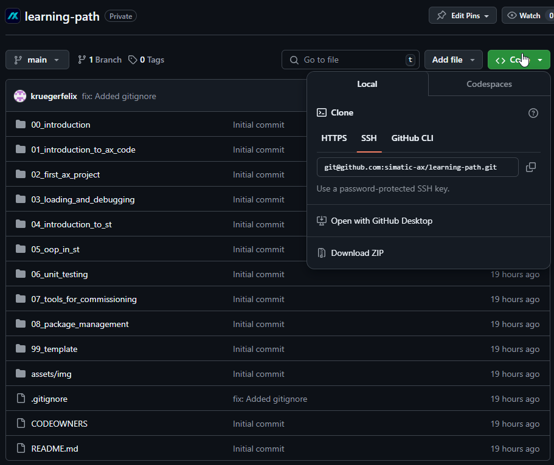
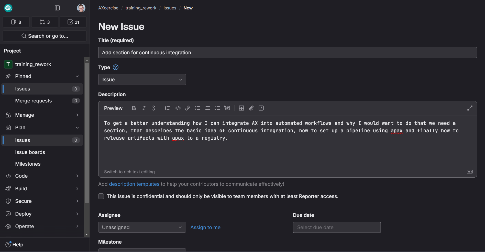

## How to get the learning path
To retrieve the learning path, you can 
### 1. Clone the directory using git with the command 
```
git clone https://code.siemens.com/axcercise/training_rework.git
```
This will create a new directory in the folder you executed the git clone from.

### 2. Download the repository as an archive
Click on `Code` in the gitlab repository overview and select one of the archive formats to download the entire repository. You then have to uncompress the downloaded archive file with a tool like 7zip and are ready to go!



## Prerequisites:
For the interactive slides, you need to have a few software packages installed to your PC:
- npm
- nodejs
- Reveal.md


To get started, please make sure to download and install both npm and nodejs. Once you installed both of these packages, you can install Reveal.md using the command
```npm install --global reveal-md```.

Please note that this will install 3rd party executable files to your PC.

## Starting the slides
For starting the slides, please navigate into the respective directory in the command line
```cd ./00_introduction``` and execute the command ```apax present```. 
This will start reveal-md with the slides of the section you navigated to. 


## How to report issues, ideas and suggestions
This learning path is supposed to be a living document and be adjusted to your needs, the needs of your customers and the development of AX itself. 

To improve the slides we are in need of feedback from you, as everything with AX it is a community effort! To provide the feedback, please add an issue where you describe, what you want us to change or where there is a mistake.

Of course you can always do it yourself and send us a merge request!

In case of questions or further discussions, feel free to get in contact with one of our [CODEOWNERS](./CODEOWNERS)